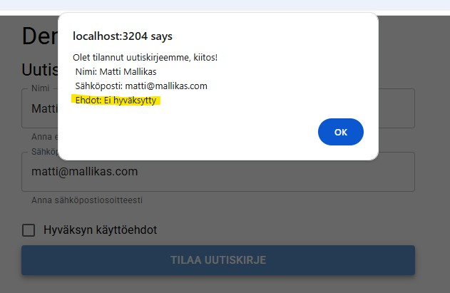
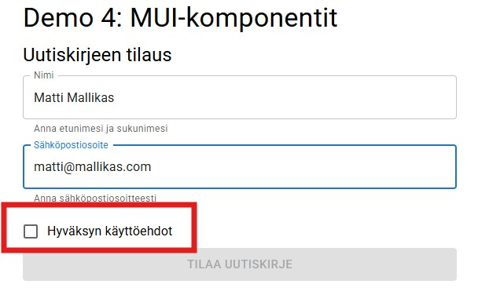
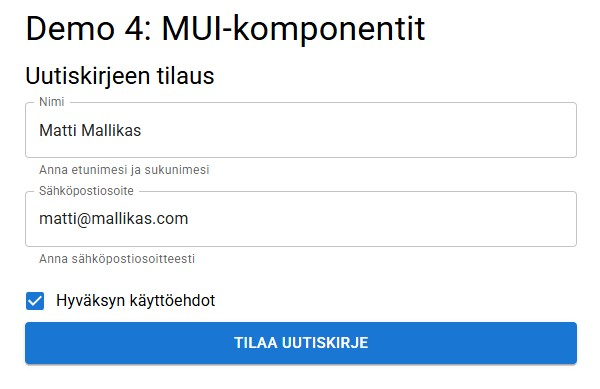
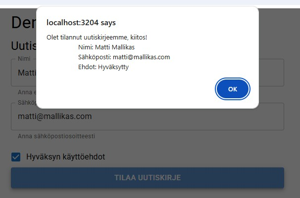

# Demo 4: Läpikulku

Demossa toteutetaan uutiskirjeen tilauslomake MUI-komponenttikirjastolla. Demossa harjoitellaan ulkoisen komponenttikirjaston asentaminen ja käyttöönotto, sekä tutustutaan muutamiin MUI:n komponentteihin ja siihen, miten niitä voidaan hyödyntää ja minkälaisia valmiita ominaisuuksia niistä löytyy. Demo ei ole kattava ja käy läpi läheskään kaikkia MUI:n tarjoamia ominaisuuksia, joten näihin pitää tutustua myös itse oppimistehtäviä varten.

Tärkeimmät linkit opiskeluun:

- [MUI:n asennus](https://mui.com/material-ui/getting-started/)
- [Komponentit ja niiden käyttö](https://mui.com/material-ui/all-components/)

## 1. Asennetaan MUI-komponenttikirjasto ja Roboto-fontti

Seuraa [MUI:n ohjeita](https://mui.com/material-ui/getting-started/installation/) kirjaston asentamiseksi. Alla sama työnkulku tiivistettynä.

**Asennetaan MUI**
```bash
npm install @mui/material @emotion/react @emotion/styled
```

**Asennetaan Roboto-fontti**
```bash
npm install @fontsource/roboto
```

**Otetaan Roboto käyttöön sovelluksessa tekemällä sen tuonnit main.tsx-tiedostoon**
```tsx
import { StrictMode } from 'react';
import { createRoot } from 'react-dom/client';
import App from './App.tsx';
import '@fontsource/roboto/300.css';
import '@fontsource/roboto/400.css';
import '@fontsource/roboto/500.css';
import '@fontsource/roboto/700.css';

createRoot(document.getElementById('root')!).render(
  <StrictMode>
    <App />
  </StrictMode>,
);
```

## 2. Rakennetaan sovelluksen käyttöliittymä ennen logiikkaa

Sovelluksen aiheena on uutiskirjeen tilauslomake. Käytetään MUI:n valmiita komponentteja käyttöliittymän toteuttamiseen. MUI:n kaikkien komponenttien ohjeet löydät [virallisesta dokumentaatiosta](https://mui.com/material-ui/all-components/).

Sovellus koostuu seuraavista MUI-komponenteista:

- **Container**: Käyttöliittymän kehys, joka asettelee sisällön automaattisesti keskelle. Containerilla voidaan esimerkiksi määrittää käyttöliittymän maksimileveys selainikkunassa.
- **Typography**: Komponentti tekstisisällön tulostamiseen. Tekstielementti valmiilla muotoiluilla. Tekstin muotoilu välitetään komponentin variant-ominaisuutena.
- **TextField**: Komponentti syöttökenttien toteuttamiseen. Käytetään lomakkeessa nimen ja sähköpostin keräämiseen.
- **Checkbox**: Komponentti checkbox-tyyppisen valinnan toteuttamisen. Käytetään lomakkeessa ehtojen hyväksymiseen.
    - **FormControlLabel**: Checkboxin käyttämä komponentti, jolla voidaan lisätä ohjeteksti laatikon viereen.
- **Button**: Komponentti, joka toteuttaa painikkeen. Painikkeen tyyli välitetään komponentin variant-ominaisuudella.

### 2.1 Luodaan näkymän kehys Container-komponentilla

[Container-komponenttia](https://mui.com/material-ui/react-container/) käytetään sisällön asetteluun. Komponentin `maxWidth`-ominaisuutta käytetään maksimileveyden määrittämiseen. Jos selainikkunan leveys on pienempi kuin komponenttiin määritetty maksimileveys, Container venytetään responsiivisesti koko selainikkunan leveyteen. Kun selainikkuna ylittää asetetun maksimileveyden, komponentti jää tähän leveyteen ja automaattisesti selainikkunan keskelle vaakasuunnassa.

```tsx
import { Container } from "@mui/material";

function App() {
    return (
        <Container maxWidth="sm">
        </Container>
    );
}

export default App;
```

Nyt Container voi korvata komponentin palautuksessa tyhjät React Fragment -tunnisteet (`<>...</>`), sillä se toimii koko komponentin kaikkien muiden sisältöjen kehyksenä. React-komponentti saa palauttaa vain yhden JSX-elementin (jonka sisälle muut elementit tulevat), mutta sen ei tietenkään tarvitse olla tyhjä JSX-elementti.

### 2.2 Testataan Typographya luomalla otsikkoja

[Typography-komponentti](https://mui.com/material-ui/react-typography/) hoitaa kaikkien tekstisisältöjen muotoilun ja skaalauksen. Tekstien skaalaus perustuu Material Design -sääntöihin. Muuten Typography on aika rajallinen komponenti, sillä se ei tekstin painon ja koon lisäksi tarjoa juurikaan valmiita tyylejä. Tekstin tyylejä voi kuitenkin [muokata ja lisätä](https://mui.com/material-ui/customization/typography/#adding-disabling-variants) itse halutessaan.

```tsx
import { Container, Typography } from "@mui/material";

function App() {
    return (
        <Container maxWidth="sm">

            <Typography variant="h4">Demo 4: MUI-komponentit</Typography>

            <Typography variant="h5"
                sx={{
                    marginTop: "10px",
                    marginBottom: "10px"
                }}
            >Uutiskirjeen tilaus</Typography>

        </Container>
    );
}

export default App;
```

Komponentteja voi yleisesti myös muokata oletustyylien osalta. [Yksittäisen komponentin muokkaus](https://mui.com/material-ui/customization/how-to-customize/#1-one-off-customization) yhtä tilannetta varten tapahtuu helposti "inline"-tyylisesti käyttämällä `sx`-ominaisuutta. `sx` voi ottaa vastaan objekti-rakenteessa `{ avain1: arvo1, avain2: arvo2, ... }` niin monta tyylimäärittelyä kuin tarvitaan. Huomioi vain oikean syntaksin käyttö.

Jos ihmettelet yllä olevassa Typography-esimerkissä, miksi `sx`-ominaisuudessa on kahdet aaltosulkeet `sx={{...}}`, niin se johtuu siitä, että uloimpia käytetään JavaScript-koodin upottamiseen ja sisemmät määrittävät objektin rakenteen.

### 2.3 Lisätään lomakkeen syöttökentät TextField-komponetteina

[TextField-komponentilla](https://mui.com/material-ui/react-text-field/) voidaan toteuttaa useita erilaisia syöttökenttiä eri tyyleillä ja tiloilla. TextField sisältää useita ominaisuuksia, joilla voidaan määrittää esim. onko tekstikenttä pakollinen täyttää, onko se "päällä" (disabled), piilotetaanko siihen kirjoitettu teksti (password) jne.

Toteutetaan TextField-komponenteilla lomakkeen kentät käyttäjän nimen ja sähköpostin tiedoille. Jätetään kentät tässä "tyhmiksi" ja lisätään ohjelman logiikka vasta myöhemmin.

```tsx
import { Container, Typography, TextField } from "@mui/material";

function App() {
    return (
        <Container maxWidth="sm">

            <Typography variant="h4">Demo 4: MUI-komponentit</Typography>

            <Typography variant="h5"
                sx={{
                    marginTop: "10px",
                    marginBottom: "10px"
                }}
            >Uutiskirjeen tilaus</Typography>

            <TextField
                sx={{
                    marginBottom: "10px"
                }}
                label="Nimi"
                fullWidth
                helperText="Anna etunimesi ja sukunimesi"
            />

            <TextField
                sx={{
                    marginBottom: "10px"
                }}
                label="Sähköpostiosoite"
                fullWidth
                helperText="Anna sähköpostiosoitteesti"
            />

        </Container>
    );
}

export default App;
```

TextField-komponentteihin tehtiin seuraavat määritykset ominaisuuksilla:

- `sx={{ marginBottom: ... }}`: Tyhjää väliä kenttien alle.
- `label`: Kentän nimi.
- `fullWidth`: Antaa kentälle maksimileveyden, joka määräytyy kentän yläpuolella olevan elementin mukaan (tässä Container)
- `helperText`: Kentän alla oleva ohjeteksti.

### 2.4 Checkbox-komponenttia voidaan käyttää valinnan tekemiseen

Lisätään lomakkeelle vielä ehtojen hyväksymisen laatikko, joka pitää ruksia lomakkeen lähettämiseksi. Tällaiset kontrollit toteutetaan yleensä [checkbox-tyyppisellä](https://mui.com/material-ui/react-checkbox/) input-elementillä. Myös HTML-merkintäkielessä on valmiit elementit sekä tekstikentän, että checkboxin toteuttamiselle. Teknisesti kumpikin ovat input-kenttiä, joilla on vain erilainen muotoilu ja toiminta.

```tsx
import { Checkbox, Container, FormControlLabel, Typography, TextField } from "@mui/material";

function App() {
    return (
        <Container maxWidth="sm">

            <Typography variant="h4">Demo 4: MUI-komponentit</Typography>

            <Typography variant="h5"
                sx={{
                    marginTop: "10px",
                    marginBottom: "10px"
                }}
            >Uutiskirjeen tilaus</Typography>

            <TextField
                sx={{
                    marginBottom: "10px"
                }}
                label="Nimi"
                fullWidth
                helperText="Anna etunimesi ja sukunimesi"
            />

            <TextField
                sx={{
                    marginBottom: "10px"
                }}
                label="Sähköpostiosoite"
                fullWidth
                helperText="Anna sähköpostiosoitteesti"
            />

            <FormControlLabel control={<Checkbox/>} label="Hyväksyn käyttöehdot" />

        </Container>
    );
}

export default App;
```

Checkboxin mukana tuotiin käyttöön FormControlLabel, jolla voidaan määrittää Checkboxin teksti. Jos label-tekstiä halutaan käyttää, niin Checkbox pitää upottaa FormControlLabelin sisään, kuten yllä koodissa ja Checkbox määritellään FormControlLabel:n control-ominaisuudeksi.

### 2.5 Nappi lähettää lomakkeen

Viimeinen elementti uutiskirjeen tilauslomakkeessa on nappi, joka lähettää lomakkeen eteenpäin. MUI:n [Button-komponentti](https://mui.com/material-ui/react-button/) otetaan käyttöön täysin samalla tavalla kuin aiemmissa demoissa `<button>`-elementti. Nyt nappi on vain valmiiksi muotoiltu erilaisilla vaihtoehdoilla (variant).

```tsx
import { Button, Checkbox, Container, FormControlLabel, Typography, TextField } from "@mui/material";

function App() {
    return (
        <Container maxWidth="sm">

            <Typography variant="h4">Demo 4: MUI-komponentit</Typography>

            <Typography variant="h5"
                sx={{
                    marginTop: "10px",
                    marginBottom: "10px"
                }}
            >Uutiskirjeen tilaus</Typography>

            <TextField
                sx={{
                    marginBottom: "10px"
                }}
                label="Nimi"
                fullWidth
                helperText="Anna etunimesi ja sukunimesi"
            />

            <TextField
                sx={{
                    marginBottom: "10px"
                }}
                label="Sähköpostiosoite"
                fullWidth
                helperText="Anna sähköpostiosoitteesti"
            />

            <FormControlLabel control={<Checkbox/>} label="Hyväksyn käyttöehdot" />

            <Button
                variant="contained"
                fullWidth
                size="large"
            >
              Tilaa uutiskirje
            </Button>

        </Container>
    );
}

export default App;
```

Nyt sovelluksen käyttöliittymä on valmis ja seuraavaksi voidaan rakentaa lomakkeen tekninen toteutus. Tässä demossa lomaketta ei oikeasti lähetetä mihinkään, vaan onnistunutta lähettämistä simuloidaan selaimen alert-tapahtumalla.

## 3. Lomakkeen tekninen toteutus

Lomakkeen toteuttamiseksi tarvitaan muutamia toimintoja:

- Kenttien tiedon muuttumiseen pitää voida reagoida ja kenttiin syötetyt tiedot pitää tallentaa johonkin.
- Vajaata lomaketta ei voida lähettää, eli:
    - kenttiin syötettyjen tietojen tilaa pitää seurata kootusti jotenkin, ja
    - Lomakkeen lähetyspainikkeen painaminen pitää ehdollistaa siten, että vasta kaikkien tietojen antamisen jälkeen painike aktivoituu.

### 3.1 Kenttien tietoja seurataan tilamuuttujalla

Lomakkeen tietojen tallentaminen tapahtuu kuten aiemmissakin demoissa. Tässä on kaksi vaihtoehtoa:

1. Lomakkeen yksittäiset kenttien tiedot voidaan tallentaa omiin tilamuuttujiinsa (kömpelö ja huono ratkaisu).
2. Lomakkeen tiedot voidaan tallentaa kootusti yhteen tilamuuttujaan, jonka tyyppi ottaa vastaan lomaketietojen muotoista dataa (parempi ratkaisu).

Jälkimmäisen vaihtoehdon toteuttamiseen tarvitaan itse tilamuuttujan lisäksi sen tyypin määrittely, joka on jonkinlainen lomaketietoja tallentava objekti. Lomaketietojen tyyppi voidaan toteuttaa TypeScript `interface`:n avulla ja se asetetaan lomakkeen tietoja tallentavan tilamuuttujan tyypiksi:

```tsx
import { Button, Checkbox, Container, FormControlLabel, Typography, TextField } from "@mui/material";
import { useState } from 'react';

interface Lomaketiedot {
  nimi: string;
  email: string;
  ehdot: boolean;
}

function App() {

    const [lomaketiedot, setLomaketiedot] = useState<Lomaketiedot>();

    return (...);
}

export default App;
```

Lomakkeen tietoja seurataan siis objektilla, joka sisältää kentät lomakkeessa annetuille nimelle ja sähköpostiosoitteelle ja Checkboxin valinnalle. Koska lomakkeen tilausehdot kuvaavat kyllä/ei -tyyppistä tietoa, voidaan sen tyypiksi asettaa Boolean, eli totuusarvo (true/false). Myös Checkbox-komponentista saatava `checked`-tieto tukee tämän tietotyypin käyttöä. TextField-komponenteista saatava tieto on tietenkin tekstiä, eli ne tallennetaan merkkijonoina.

Kun lomaketietojen `interface Lomaketiedot` on luotu, voidaan luoda tilamuuttuja `lomaketiedot`, jonka tyyppiksi luotu tietorakenne asetetaan.

Seuraavaksi voidaan lisätä lomakkeen syöttökenttien MUI-komponentteihin tapahtumat ja niiden käsittelijät, joissa kenttien arvot tallennetaan niitä vastaavaan `Lomaketiedot`-objektin arvoon.

```tsx
return (
    <Container maxWidth="sm">

        <Typography variant="h4">Demo 4: MUI-komponentit</Typography>
        <Typography variant="h5" sx={{
            marginTop: "10px",
            marginBottom: "10px"
        }}>Uutiskirjeen tilaus</Typography>

        <TextField
            sx={{
            marginBottom: "10px"
            }}
            label="Nimi"
            fullWidth
            helperText="Anna etunimesi ja sukunimesi"
            onChange={(e) => {
            setLomaketiedot({ ...lomaketiedot, nimi: e.target.value })
            }} />

        <TextField
            sx={{
            marginBottom: "10px"
            }}
            label="Sähköpostiosoite"
            fullWidth
            helperText="Anna sähköpostiosoitteesti"
            onChange={(e) => {
            setLomaketiedot({ ...lomaketiedot, email: e.target.value })
            }} />

        <FormControlLabel control={<Checkbox
            onChange={(e) => {
            setLomaketiedot({ ...lomaketiedot, ehdot: e.target.checked })
            }} />} label="Hyväksyn käyttöehdot" />

        <Button
            variant="contained"
            fullWidth
            size="large"
        >
            Tilaa uutiskirje
        </Button>

    </Container>
);
```

Lomaketiedon tallentaminen tapahtuu jokaisen kentän omassa `onChange`-tapahtumassa, jonka käsittelijäksi määritetään nuolifunktio `() => {}`. Nuolifunktiossa kutsutaan `lomaketiedot`-tilamuuttujan "setter"-funktiota `setLomaketiedot`, johon syötetään lomaketietojen uusi arvo.

**HUOMIOI**, että kun päivitetään objektin muotoista tilamuuttujaa, niin koko objektin data pitää vaihtaa uuteen versioon. Ei siis voida päivittää vain yhtä kenttää nykyisessä tiedossa, vaan nyt pitää (a) ottaa tämänhetkiset `lomaketiedot`; (b) kopioida olemassa olevan objektin tiedot uuteen objektiin; (c) määrittää uudelle objektille päivitetyn kentän arvo, joka korvaa vanhan arvon; ja (d) tallentaa uusi objekti tilamuuttujan vanhojen tietojen tilalle. Tämä tapahtuu seuraavasti kentän tapahtumakäsittelijässä:

1. Kutsutaan `lomaketiedot`-tilamuuttujan "setteriä"
    - `setLomaketiedot()`
2. Valmistaudutaan syöttämään arvoksi kokonaan uusi objektirakenne lisäämällä sulkujen sisään aaltosulkeet `{}`
    - `setLomaketiedot({})`
3. Kopioidaan nykyiset lomaketiedot uuteen objektiin käyttäen JavaScriptin spread-operaattoria
    - `setLomaketiedot({ ...lomaketiedot })`
4. Ylikirjoitetaan syöttökenttää vastaava tieto
    - `setLomaketiedot({ ...lomaketiedot, nimi: e.target.value})` (oletetaan, että vaihdetaan nimi-kentän tietoa)

<br>

**Ohjelman toiminnassa on kuitenkin vielä virhe.** `lomaketiedot`-tilamuuttujan arvoa ei ole alustettu missään vaiheessa ohjelman käynnistymisen yhteydessä, jolloin heti suorituksen alussa tilamuuttujan arvo on `undefined`. Spread-operaatio yrittää kuitenkin kopioida `lomaketiedot`-objektin, jota ei vielä ole olemassa.

Ongelma korjaantuu, kun määritetään lomaketiedoille oletusarvot tyhjillä tiedoilla. Näin olisi oikeastaan pitänyt toimia jo heti alussa, mutta halusin havainnollistaa tämän ongelman, jotta olisi selkeää, miten ohjelman eri osat ovat riippuvaisia toisistaan.

Lisätään siis koodiin vielä seuraava määrittely `lomaketiedot`-tilamuuttujan esittelyyn:

```tsx
import { Button, Checkbox, Container, FormControlLabel, TextField, Typography } from "@mui/material";
import { useState } from "react";

interface Lomaketiedot {...}

function App() {

  const [lomaketiedot, setLomaketiedot] = useState<Lomaketiedot>({
    nimi: "",
    email: "",
    ehdot: false
  });

  return (...);
}
```

Nyt lomakkeen tietojen asettaminen syöttökenttien tapahtumakäsittelijöissä pitäisi onnistua.

### 3.2 Lomakkeen "lähettäminen" nappia painamalla

Nyt kun lomakkeen tietojen tallentamisen logiikka on rakennettu, voidaan toteuttaa lomakkeen lähettäminen nappia painamalla. Tässä demossa tietoja ei lähetetä oikeasti, mutta voidaan simuloida tietojen lähettäminen muuten.

Lisätään painikkeelle `onClick`-tapahtuma, jonka käsittelijässä tulostetaan selaimeen kiitosviesti onnistuneesta tilauksesta.

```tsx
return (
    <Container maxWidth="sm">

        <Typography variant="h4">Demo 4: MUI-komponentit</Typography>
        <Typography variant="h5" sx={{
            marginTop: "10px",
            marginBottom: "10px"
        }}>Uutiskirjeen tilaus</Typography>

        <TextField
            sx={{
            marginBottom: "10px"
            }}
            label="Nimi"
            fullWidth
            helperText="Anna etunimesi ja sukunimesi"
            onChange={(e) => {
            setLomaketiedot({ ...lomaketiedot, nimi: e.target.value })
            }} />

        <TextField
            sx={{
            marginBottom: "10px"
            }}
            label="Sähköpostiosoite"
            fullWidth
            helperText="Anna sähköpostiosoitteesti"
            onChange={(e) => {
            setLomaketiedot({ ...lomaketiedot, email: e.target.value })
            }} />

        <FormControlLabel control={<Checkbox
            onChange={(e) => {
            setLomaketiedot({ ...lomaketiedot, ehdot: e.target.checked })
            }} />} label="Hyväksyn käyttöehdot" />

        <Button
            variant="contained"
            fullWidth
            size="large"
            onClick={() => {
            alert(`Olet tilannut uutiskirjeemme, kiitos!
                    Nimi: ${lomaketiedot.nimi}
                    Sähköposti: ${lomaketiedot.email}
                    Ehdot: ${lomaketiedot.ehdot ? "Hyväksytty" : "Ei hyväksytty"}`)
            }}>
            Tilaa uutiskirje
        </Button>

    </Container>
);
```

Nyt lomakkeen pitäisi toimia! Voidaan testata toiminnallisuutta syöttämällä tiedot ja painamalla lähetä.



Hetkinen... Nyt unohdin hyväksyä käyttöehdot, mutta lomake lähetettiin silti.

### 3.3 Lomakkeen tietojen validointi

Lomaketta ei koskaan saisi lähettää tarpeellisten tietojen puuttuessa. Nyt uutiskirjeen tilauslomake on vielä keskeneräinen, sillä siihen ei ole toteutettu minkäänlaista tietojen varmentamista. Itseasiassa nyt käyttäjä voisi lähettää täysin tyhjän lomakkeen. Tiedot kyllä kerätään, mutta lomakkeen lähettämistä ei estetä ilman tietojen olemassaoloa.

Toteutetaan sovellukseen vielä lomaketietojen tilan seuranta ja napin aktivoiminen vasta kaikkien tietojen ollessa hyväksytyssä muodossa. Tässä lomakkeessa tiedot voidaan hyväksyä vasta kun lomaketiedoissa olevat `nimi` ja `email` sisältävät merkkijonon ja `ehdot` on true.

#### 3.3.1 Napin asettaminen päälle/pois

Tehdään aluksi lomakkeen napista sellainen, että se aktivoituu vain jonkin ehdon ollessa tosi. MUI:n Button-komponentti sisältää [ominaisuuden](https://mui.com/material-ui/react-button/#contained-button) `disabled`, jolla napin painaminen voidaan estää. Sen lisäksi, että nappiin voidaan määrittää `disabled`-ominaisuus, sille voidaan määrittää myös ehto, jolla `disabled`-ominaisuus aktivoituu. Se tehdään sijoittamalla ominaisuuteen argumentti, kuten muissakin ominaisuuksissa.

```tsx
    <Button
        variant="contained"
        fullWidth
        size="large"
        disabled={!tiedotOk}
        onClick={() => {
        alert(`Olet tilannut uutiskirjeemme, kiitos!
                Nimi: ${lomaketiedot.nimi}
                Sähköposti: ${lomaketiedot.email}
                Ehdot: ${lomaketiedot.ehdot ? "Hyväksytty" : "Ei hyväksytty"}`)
        }}>
        Tilaa uutiskirje
    </Button>
```

Yllä olevassa koodissa on määritelty, että nappi on `disabled` silloin, kun muuttuja `tiedotOk` on arvoltaan `false` *(not-operaattori `!` ennen muuttujan nimeä)*. Nyt pitää luoda komponenttiin uusi tilamuuttuja tällä nimellä, joka on totuusarvoa (Boolean). Tehdään tilamuuttujasta oletusarvoltaan myös `false`, koska kun sovellus käynnistetään, niin eihän silloin lomakkeeseen ole vielä voitu lisätä mitään tietoja, eli napin pitää olla pois päältä.

```tsx
function App() {

  const [lomaketiedot, setLomaketiedot] = useState<Lomaketiedot>({...});

  const [tiedotOk, setTiedotOk] = useState<boolean>(false);

  return (...);
}
```

Nyt nappi on saatu tottelemaan `tiedotOk`-tilamuuttujan arvoa, mutta seuraavaksi pitäisi toteuttaa jonkinlainen toiminnallisuus, jolla tilamuuttujan arvo saadaan vaihdettua perustuen lomaketietojen tilaan. Jos jokin lomaketiedoista puuttuu, `tiedotOk === false`. Jos kaikki tiedot on annettu hyväksytysti, `tiedotOK === true`.

#### 3.3.2 Lomakkeen tietojen seuraaminen

Tähän onkin olemassa useita eri tapoja toteuttaa lomaketietojen seuranta ja `tiedotOk` vaihtuminen. Esittelen tässä kuitenkin yhden tehokkaan tavan seurata lomakkeen tietoja helposti hyvin yksinkertaisella koodilla.

Otetaan käyttöön Reactin `useEffect`-hook, jolla mm. voidaan seurata komponentin tilassa tapahtuvia muutoksia ja suorittaa komentoja automaattisesti tilan päivittyessä. Muista, että tilan päivittyminen tapahtuu esim. silloin, kun syöttökentän arvo muuttuu.

`useEffect` on funktio, johon syötetään kaksi argumenttia `useEffect(() => {}, [])`:

1. `() => {}`: Callback-funktio, joka suoritetaan joka kerta, kun `useEffect` suoritetaan.
2. `[]`: Taulukko riippuvuuksista, joita seurataan. Jos jokin taulukossa olevista tiedoista muuttuu, `useEffect`-hook suoritetaan automaattisesti.

`useEffect`-hookin seuraamien riippuvuuksien ei ole pakko olla nimenomaan tilamuuttujia, mutta tässä demossa `lomaketiedot`-tilamuuttujassa tapahtuviin muutoksiin on tarve reagoida, jolloin siitä tehdään `useEffect`-hookin riippuvuus:

```tsx
import { useEffect, useState } from 'react';

interface Lomaketiedot {...}

function App() {

    const [lomaketiedot, setLomaketiedot] = useState<Lomaketiedot>({...});

    const [tiedotOk, setTiedotOk] = useState<boolean>(false);

    useEffect(() => {}, [lomaketiedot]);

    return (...);
}
```

Nyt kun voidaan seurata lomaketietojen muuttumista, voidaan rakentaa logiikka `tiedotOk`-tilan vaihtumiselle. Tämä logiikka kirjoitetaan `useEffect`-hookin callback-funktioon, jotta se suoritetaan lomaketietojen muuttumisen yhteydessä automaattisesti.

Kerrataan vielä lomaketietojen seurannan ja napin aktivoitumisen logiikka:

1. Jos lomaketiedoista puuttuu jokin syöttökenttä, `tiedotOk` on `false` ja nappi on pois päältä.
2. Kun lomaketietoa päivitetään, `useEffect` suoritetaan ja siinä oleva callback suoritetaan.
3. Kun kaikki lomaketiedot on annettu hyväksytysti, `tiedotOk` pitää vaihtaa `true`-arvoon.
4. Kun `tiedotOk` on `true`, nappi aktivoituu automaattisesti ja lomake voidaan lähettää.

Yllä olevasta tapahtumaketjusta puuttuu siis vielä logiikka lomaketietojen tarkastamiselle. Tämä onnistuu helposti if-rakenteella. If-rakenne voidaan toteuttaa joko if...else-lausekkeella tai ternary operaatiolla. Ternary operaatiolla ehtorakenteen saa kirjoitettua tiiviimmin, mutta se toimii muuten täysin samalla tavalla.

**Toteutettu if...else-rakenteella**
```tsx
useEffect(() => {

    if (lomaketiedot.nimi && lomaketiedot.email && lomaketiedot.ehdot) {
        setTiedotOk(true);
    } else {
        setTiedotOk(false);
    }

}, [lomaketiedot]);
```

**Toteutettu ternary-operaationa**
```tsx
useEffect(() => {

    setTiedotOk(Boolean(lomaketiedot.nimi && lomaketiedot.email && lomaketiedot.ehdot) ? true : false)

}, [lomaketiedot]);
```

On ihan sama, kumpaa tapaa käyttää. Tässä vielä lopullinen koodi kokonaan:

```tsx
import { Button, Checkbox, Container, FormControlLabel, TextField, Typography } from "@mui/material";
import { useEffect, useState } from "react";

interface Lomaketiedot {...}

function App() {

  const [lomaketiedot, setLomaketiedot] = useState<Lomaketiedot>({
    nimi: "",
    email: "",
    ehdot: false
  });

  const [tiedotOk, setTiedotOk] = useState<boolean>(false);

  useEffect(() : void => {

    setTiedotOk(Boolean(lomaketiedot.nimi && lomaketiedot.email && lomaketiedot.ehdot) ? true : false)
    
  }, [lomaketiedot]);

  return (...);
}
```

Nyt uutiskirjeen tilauslomake on viimein valmis. Voidaan vielä testata lomakkeen toimintaa ja napin aktivoitumista:

**Lomakkeen tiedot ovat vajaavaiset**



**Lomakkeen tiedot ovat täytetty**



**Lomakkeen onnistunut "lähetys"**



## 4. Lopuksi

Tässä demossa tutustuttiin MUI-komponenttien käyttöönottoon ja toimintaan ja toteutettuun uutiskirjeen tilauslomake. Samalla perehdyttiin lomakkeen käsittelyyn ja tietojen validointiin.